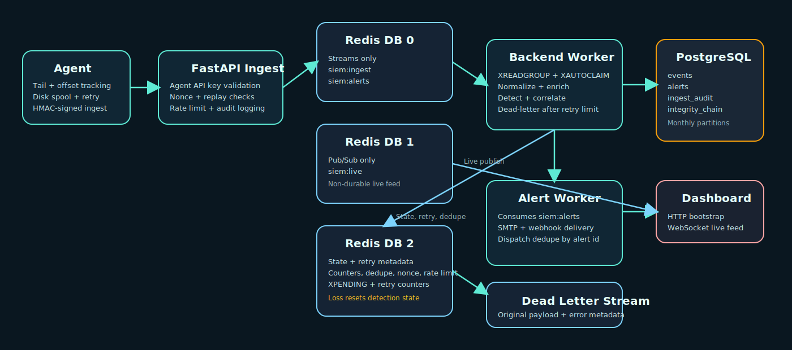

# 0xchou00-detection-platformV2

## 1. Purpose of the Project

This repository is a lab-scale SIEM pipeline built to expose the mechanics that matter in detection engineering: ingestion security, queue semantics, parser failure handling, stateful detections, alert correlation, and operational failure recovery.

The project exists because a single-process collector hides the important boundaries. Here, each stage has a separate responsibility:

- the agent handles local file state and delivery retries
- the API authenticates and admits telemetry
- Redis Streams decouples admission from processing
- workers normalize, enrich, detect, correlate, persist, and route alerts
- PostgreSQL stores the durable event and alert record
- Redis Pub/Sub is used only for live dashboard updates

That split makes failure behavior inspectable. It also forces the design questions a real detection pipeline has to answer: what happens to malformed logs, what happens to abandoned messages, and what happens when a worker fails after partially completing work.

## 2. System Overview

High-level flow:

`log file -> agent -> signed POST /ingest -> Redis Stream -> worker -> normalization -> enrichment -> detection -> correlation -> PostgreSQL -> live Pub/Sub + alert stream -> dashboard / alert worker`

From a raw line to an alert:

1. A source host writes a log line.
2. The agent tails the file, batches lines, signs the request, and sends them to `/ingest`.
3. The API validates agent identity, HMAC signature, timestamp freshness, nonce uniqueness, and per-agent rate limits.
4. Each admitted line is appended to the ingest stream with source metadata.
5. A worker consumes the stream through a consumer group, reclaims abandoned pending messages, and retries failed ones deterministically.
6. The normalizer converts the line into a typed event. If parsing fails, the line is still stored as an event with `parser_status=failed`.
7. The enrichment layer adds GeoIP, ASN, asset, identity, reputation, and suppression context.
8. The event is written to PostgreSQL and linked into the integrity chain.
9. Built-in detections and compiled YAML rules evaluate the normalized event.
10. Detector alerts are correlated into attack-chain alerts where sequence rules match.
11. Alerts are written to PostgreSQL, linked into the integrity chain, published to WebSocket subscribers, and queued for external delivery.
12. A separate alert worker delivers high and critical alerts to webhook and SMTP targets.

## 3. Architecture



### Agent

Responsibilities:

- tail configured sources with inode and offset tracking
- buffer by source type
- retry failed deliveries with exponential backoff
- keep a disk spool when the backend is unavailable
- sign every ingest request with the active agent secret

Data flow:

- input: local files
- output: HTTPS-capable JSON requests to `/ingest`

Failure behavior:

- API unavailable: batches remain in the spool file
- partial line reads: offsets prevent replay from the start of the file
- spool saturation: oldest unsent items are discarded once the configured cap is exceeded

Performance limitation:

- one agent process reads files sequentially; this is acceptable for a lab, not for very high local event fan-in

### Redis Streams

Responsibilities:

- queue raw ingest messages
- queue outbound alert deliveries
- expose pending-entry state for recovery
- hold dead-lettered messages after retry exhaustion

How it is used:

- `siem:ingest`: raw telemetry queue
- `siem:alerts`: outbound alert queue
- `siem:dead-letter`: terminal storage for poison messages

Failure behavior:

- if Redis is down, ingestion fails immediately and the agent must rely on its spool
- if a worker dies mid-message, the message remains pending until reclaimed with `XAUTOCLAIM`
- if a message exceeds the retry budget, it is moved to the dead-letter stream and acknowledged from the original stream

Performance limitation:

- Redis is still a single-node dependency in this repository; queue durability and state durability depend on that instance

### Workers

There are two workers.

`backend-worker` responsibilities:

- consume the ingest stream
- reclaim abandoned pending entries
- normalize, enrich, detect, correlate, persist, and publish

`alert-worker` responsibilities:

- consume the alert stream
- reclaim abandoned pending entries
- deliver alerts to webhook and SMTP outputs

Failure behavior:

- processing exception: retry counter increments in Redis state
- retries exhausted: message is dead-lettered with payload, reason, retry count, last error, timestamp, and source agent
- worker crash after message claim: another worker can reclaim the pending entry after `min_idle_time`

Performance limitation:

- detection remains CPU-bound and linear in rule count

### Normalization Layer

Responsibilities:

- map SSH, HTTP, and firewall log formats into one event schema
- preserve the raw line
- preserve parser error details when parsing fails

Failure behavior:

- unsupported or malformed input is not dropped
- failed parses become stored events with:
  - `event_type=unparsed_log`
  - `parser_status=failed`
  - `parser_error=<structured reason>`

Performance limitation:

- normalization is regex-based and source-type specific

### Detection Engine

Responsibilities:

- execute built-in stateful detections
- compile and execute YAML rules
- apply threshold and time-window logic
- suppress repeat alerts inside a dedupe window

Failure behavior:

- if state Redis is lost, sliding-window counters and correlation memory are lost
- stored events remain in PostgreSQL, but new state baselines start from zero

Performance limitation:

- current execution is rule-by-rule, event-by-event

### Correlation Engine

Responsibilities:

- keep recent detector alerts per grouping key
- emit higher-confidence alerts when sequences match

Current grouping:

- source IP

Failure behavior:

- if state Redis restarts, correlation history is lost
- stored detector alerts remain in PostgreSQL, but sequence memory does not recover automatically

Performance limitation:

- correlation logic is ordered sequence matching, not a general graph engine

### Storage Layer (PostgreSQL)

Responsibilities:

- store events
- store alerts
- store ingestion audit records
- store integrity-chain records
- store agent credentials and viewer/admin keys

Design notes:

- `events`, `alerts`, and `ingest_audit` are range-partitioned by month
- parent-table indexes cover common filters and JSONB search surfaces

Failure behavior:

- worker cannot ack a message until the database write succeeds
- backlog accumulates in Redis Streams until storage recovers

Performance limitation:

- PostgreSQL remains the limiting factor for sustained high-volume event retention and ad hoc search

### API Layer

Responsibilities:

- admit telemetry
- authenticate agents and API users
- expose stored events, alerts, correlations, dead letters, and ingest audit records
- expose integrity verification
- rotate agent keys

Failure behavior:

- Redis unavailable: `/ingest` fails closed
- PostgreSQL unavailable: query endpoints fail and ingest audit writes fail
- malformed client requests are audited when possible

Performance limitation:

- list endpoints are limit-based and recent-history oriented; they are not built for large deep-history search

### WebSocket System

Responsibilities:

- push live event and alert notifications to the dashboard

Failure behavior:

- Pub/Sub is intentionally non-durable
- a disconnected dashboard misses messages while offline and must re-bootstrap through the HTTP APIs

Performance limitation:

- this is a live notification plane, not a replay plane

### Dashboard

Responsibilities:

- show current pipeline counts
- show live alerts and correlations
- show timeline entries including parser failures
- expose enough surface to inspect whether the pipeline is working

Failure behavior:

- missed live events are not recovered from Pub/Sub
- HTTP bootstrap remains the source of recent truth after reconnect

Performance limitation:

- the dashboard expects recent-history usage, not large result sets

## 4. Data Pipeline (Step-by-step)

When a log line is generated, the system handles it in this order:

1. The agent reads the line from the source file.
2. The agent groups the line with other lines of the same `source_type`.
3. Before sending, the agent builds a canonical JSON body and computes:
   - timestamp
   - nonce
   - HMAC signature over `agent_id`, timestamp, nonce, key version, and body hash
4. The API receives the raw request body and validates:
   - agent ID
   - active agent API key
   - key version
   - HMAC signature
   - timestamp freshness
   - nonce uniqueness
   - per-agent rate limit
   - optional TLS requirement
5. If validation fails, the request is rejected and an `ingest_audit` record is written.
6. If validation succeeds, each non-empty line is appended to the ingest stream with:
   - `source_type`
   - `line`
   - `received_at`
   - `agent_id`
   - `ingest_source_ip`
7. A worker reads the message through a consumer group.
8. Before reading new messages, the worker checks `XPENDING` state and reclaims abandoned pending entries with `XAUTOCLAIM`.
9. The normalizer tries to parse the line into a structured event.
10. If parsing succeeds, the event gets typed fields such as `event_type`, `source_ip`, `username`, `path`, or `status`.
11. If parsing fails, the event is still formed with:
    - `event_type=unparsed_log`
    - `parser_status=failed`
    - `raw_message=<original line>`
    - `parser_error=<reason metadata>`
12. The enrichment layer adds context.
13. The worker stores the event in PostgreSQL and appends an integrity-chain record.
14. The detection engine runs built-in detections and compiled YAML rules.
15. When a detection triggers, an alert record is stored and linked into the integrity chain.
16. The correlation engine observes those alerts and emits attack-chain alerts when ordered sequences match.
17. The worker publishes live event and alert notifications to Redis Pub/Sub.
18. The worker appends alert payloads to the alert stream.
19. The alert worker consumes the alert stream and attempts external delivery.
20. If any worker step raises an exception, the message is not acknowledged. Retry state is updated, and after the configured retry count the message is moved to the dead-letter stream.

## 5. Detection Engine

### Rule format

Detection content is defined in YAML with these fields:

- `id`
- `title`
- `description`
- `severity`
- `explanation`
- `detection_logic`
- `mitre_attack`
- `source_type`
- `event_type`
- `match`
- `aggregation`
- optional `sigma`

Supported matcher operators:

- `equals`
- `contains`
- `regex`

Supported aggregation functions:

- `count`
- `distinct_count`

### Compilation strategy

Rules are schema-validated through Pydantic before execution. The compiler converts rule match clauses into typed matcher objects and precompiles regex operators. The Sigma-like subset is translated into the same internal rule model rather than executed as a separate engine.

### Execution model

Execution order is:

1. built-in detections
2. compiled YAML rules

Built-in detections currently cover:

- SSH brute force
- SSH success after failures
- unusual login time
- new source IP login
- multiple usernames from one IP
- one username from many IPs
- rare authentication event
- impossible login pattern
- port scanning

YAML rules currently cover:

- invalid SSH username bursts
- suspicious user agents
- sensitive path probing
- path traversal patterns
- command injection patterns
- web shell indicators
- HTTP 401/403 spikes
- HTTP 500 bursts
- Sigma-like SSH success matching

### Threshold logic

Thresholded rules use Redis sorted sets keyed by namespace and grouping value. For example:

- failures per source IP
- distinct usernames per source IP
- distinct source IPs per username
- distinct destination ports per source IP

### Time windows

Window logic is based on normalized event time, not arrival time. That means replay tests and delayed telemetry can still exercise the same detection logic as live telemetry.

### Limitations

- the Sigma subset is intentionally small
- state is Redis-backed and not reconstructed from PostgreSQL after restart
- built-in detections dedupe repeated alerts inside fixed windows, but event persistence is not implemented as a fully transactional outbox
- the engine does not yet optimize rule selection by source field indexes or decision trees

## 6. Correlation Engine

### State handling

Correlation state is stored in Redis sorted sets keyed by source IP. Each detector alert contributes a summarized record with:

- alert ID
- detector
- rule ID
- severity
- title
- created_at

State keys have bounded TTLs so Redis is not used as unbounded historical storage.

### Attack chain logic

A correlation rule defines:

- sequence
- grouping field
- window
- metadata

Matching is ordered and window-bounded. If the stages appear in order for the same group within the rule window, the engine emits a correlation alert and dedupes it by fingerprint.

### Example: scan -> brute force -> success

The `scan_to_bruteforce_to_success` rule requires:

1. a `port_scan` alert
2. a `brute_force` alert
3. a `session_state` alert

all for the same source IP within 15 minutes. This is intentionally simple, but it demonstrates how low-level detections can be promoted into a compromise narrative.

## 7. Integrity Model

Every stored event and alert is hashed and appended to a forward-linked chain in PostgreSQL.

Each chain record contains:

- `payload_hash`
- `prev_hash`
- `related_hashes`
- `contract_hash`
- `created_at`

What is verified:

- the chain linkage is continuous
- the stored contract hash still matches the recorded fields
- the current event or alert payload still hashes to the stored payload hash

What is not verified:

- origin authenticity at the log source
- cryptographic signing on the source host
- external timestamp authority

Performance trade-off:

- verification is linear in the number of checked entries
- the API exposes a `limit` parameter because full verification cost grows with chain length

## 8. Scalability & Performance

### Main bottlenecks

- PostgreSQL write throughput and JSONB query cost
- detection CPU for regex-heavy rule sets
- Redis as a shared dependency for queueing, state, and live notifications

### Why Redis Streams

Redis Streams was chosen because it provides:

- append-only ingestion
- consumer groups
- explicit pending-entry tracking
- reclaim via `XAUTOCLAIM`
- simple local deployment for a lab

It is easier to inspect and operate in a student lab than Kafka, while still forcing the right reliability questions.

### Worker scaling model

Workers scale horizontally by joining the same consumer group. Pending-entry recovery works across workers because stuck messages can be reclaimed by another consumer after the idle threshold.

### Database considerations

PostgreSQL is acceptable here because:

- it provides transactional writes
- JSONB makes event payload retention simple
- partitions and indexes cover recent operational querying

Where it breaks:

- long-retention raw event volumes
- wide historical scans
- ad hoc aggregations across very large event sets

How it evolves later:

- ClickHouse is a better fit for large append-heavy log retention and exploratory aggregations
- Elasticsearch/OpenSearch is a better fit for full-text and schema-flexible search workloads

### Known limits

- Redis state loss resets detection baselines and correlation memory
- Pub/Sub remains non-durable by design
- alert delivery is at-least-once from the alert stream, with duplicate suppression at dispatch time
- event persistence is durable, but there is no full transactional outbox tying PostgreSQL and Redis acknowledgements together

## 9. Failure Scenarios

### Redis is down

What happens:

- `/ingest` rejects new requests
- live dashboard updates stop
- workers cannot read or acknowledge messages
- Redis-backed detection state is unavailable

Recovery:

- the agent retains unsent batches in its spool
- once Redis returns, ingestion resumes
- pending messages can be reclaimed by workers after restart

### PostgreSQL is down

What happens:

- workers cannot persist events or alerts
- stream messages are not acknowledged
- query APIs fail

Recovery:

- Redis Streams retains the queue until storage returns
- workers resume and reclaim pending messages
- after retry exhaustion, poison messages are dead-lettered instead of disappearing

### Agent disconnects

What happens:

- no new local telemetry enters the system
- the agent keeps file offsets and spooled batches on disk

Recovery:

- when the agent comes back, it resumes from the saved offset and sends any spooled batches

### Worker crashes during processing

What happens:

- the message remains pending in the consumer group
- it is visible through `XPENDING`

Recovery:

- another worker can reclaim it with `XAUTOCLAIM`
- retry count increases on subsequent failures
- poison messages go to the dead-letter stream

## 10. Home Lab Setup

Default lab topology:

- attacker host: your local machine running `test.sh`, or a Kali VM if you want a separate source
- target: the `lab-target` container providing SSH, nginx, and connection logs
- SIEM server: Redis, PostgreSQL, API, worker, alert worker, dashboard
- forwarder: the bundled agent container

Suggested VM layout if you move beyond Docker:

- `vm1`: attacker (Kali)
- `vm2`: target (Ubuntu with SSH and nginx)
- `vm3`: detection platform
- optional `vm4`: separate forwarder

Network layout:

- attacker can reach target SSH, HTTP, and monitored TCP ports
- agent can reach the detection API
- dashboard users can reach port `5173`

Attack simulation already included:

- HTTP probing: `scripts/lab/http_probe.sh`
- connect scan: `scripts/lab/port_scan.sh`
- SSH brute force: `scripts/lab/ssh_bruteforce.sh`

## 11. Quick Start

Minimal commands:

```bash
git clone https://github.com/0xchou00/0xchou00-detection-platformV2.git
cd 0xchou00-detection-platformV2
./setup.sh
./scripts/check.sh
./run.sh
./test.sh
```

Expected outcome:

- `./run.sh` starts Redis, PostgreSQL, API, workers, dashboard, lab target, and agent
- `./test.sh` generates HTTP probes, a port scan, and an SSH brute-force sequence
- the dashboard at `http://127.0.0.1:5173` shows live alerts and timeline updates
- `GET /alerts`, `GET /correlations`, `GET /events?parser_status=failed`, `GET /dead-letters`, and `GET /ingest-audit` all return meaningful data

Useful checks:

```bash
curl -H "X-API-Key: siem-viewer-dev-key" http://127.0.0.1:8000/health
curl -H "X-API-Key: siem-viewer-dev-key" "http://127.0.0.1:8000/events?parser_status=failed&limit=20"
curl -H "X-API-Key: siem-viewer-dev-key" "http://127.0.0.1:8000/dead-letters?limit=20"
curl -H "X-API-Key: siem-viewer-dev-key" "http://127.0.0.1:8000/alerts?limit=20&since_minutes=30"
curl -H "X-API-Key: siem-viewer-dev-key" "http://127.0.0.1:8000/correlations?limit=10&since_minutes=30"
python3 -m pytest backend/tests -q
```

Basic troubleshooting:

- API never becomes healthy:
  - inspect `docker compose logs -f backend-api backend-worker postgres redis`
- attacks run but no alerts appear:
  - inspect `docker compose logs -f agent backend-worker lab-target`
- dashboard is blank:
  - verify `/health` and `/alerts` first, then inspect browser WebSocket connectivity
- dead-letter count is growing:
  - inspect `/dead-letters` and `/ingest-audit` before restarting services

Kali Linux compatibility:

- use `./setup.sh` on Kali, Debian, or Ubuntu
- `setup.sh` installs `docker.io` plus `docker-compose` when available and falls back to the Python package if the OS repository does not provide it
- `./scripts/check.sh` validates Docker, compose, and memory before the stack starts

Common errors and fixes:

- `.env is missing`:
  - run `./setup.sh` again, or copy `.env.example` to `.env`
- `docker-compose` not found:
  - rerun `./setup.sh`; it installs the OS package first and falls back when needed
- `docker daemon is not running or the current user cannot access it`:
  - run `./scripts/check.sh` to see the exact failure, then add the user to the `docker` group or run the stack with passwordless `sudo`
- `Attribute name 'metadata' is reserved`:
  - update to the current `backend/app/v2/db.py`; the alert model now uses `alert_metadata`
- `ERR_CONNECTION_REFUSED` on the dashboard:
  - check `./run.sh` output and the backend logs; the dashboard depends on the API being up first

## 12. Design Trade-offs

What was intentionally simplified:

- one Redis deployment is used, but responsibilities are split by logical database and channel:
  - DB 0: streams
  - DB 1: Pub/Sub
  - DB 2: state and retry metadata
- enrichment uses local static maps plus optional GeoIP databases
- detection state is ephemeral and bounded

What would change at larger scale:

- move live and queue reliability into separate Redis or Kafka deployments
- move long-retention events to ClickHouse or Elasticsearch/OpenSearch
- add source-specific parsers beyond SSH, web, and firewall logs
- add background jobs to rebuild derived state after Redis loss
- add per-message processing journals or an outbox for stricter exactly-once side effects

## 13. Future Improvements

- add dashboard views for dead-letter messages and ingest audit failures
- add automated state rebuild from PostgreSQL for selected baselines
- add agent support for pulling rotated keys automatically
- add richer parser coverage for auth, sudo, cloud audit, and DNS telemetry
- add integration tests that boot the stack and assert alert generation through the API
